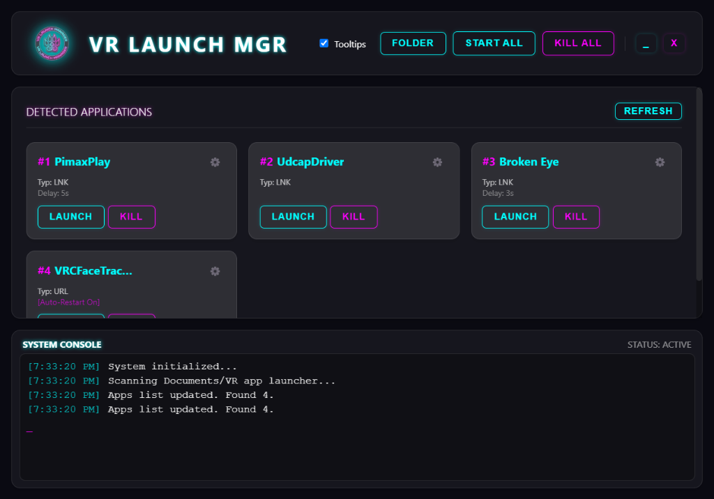

# VR Launch Manager

> **New to coding?** [Click here for a step-by-step guide on how to build and install this app easily.](./INSTALL_GUIDE.md)

A specialized, high-performance application launcher designed to manage the startup sequence of Virtual Reality (VR) middleware, utilities, and games. 

Launchers for VR setups often require specific boot orders, delays, and robust crash recovery. **VR Launch Manager** solves this by providing a unified, "Glassmorphism" styled interface to organize, monitor, and control your VR ecosystem.



## Features

*   **Sequential Startup**: Launch your entire VR stack with a single click ("Start All").
*   **Process Monitoring**: Real-time tracking of running apps. If the launcher says it's running, it's running.
*   **Auto-Restart**: Optional "Watchdog" mode for critical apps (like face tracking or haptic drivers). If they crash, they are instantly restarted.
*   **Crash Detection**: Smart detection of process exit codes.
*   **Custom Launch Delays**: Set specific wait times between apps to ensure drivers load before the game starts.
*   **Drag & Drop Ordering**: Easily organize your boot order by dragging app cards.
*   **Force Kill**: immediate termination of unresponsive processes.
*   **Shortcut Resolution**: Intelligently resolves Windows Shortcuts (`.lnk`) to their actual executables for accurate PID tracking.

## Usage

1.  **Installation**:
    *   Download the latest release or build from source.
    *   Run `VR Launch Manager.exe`.

2.  **Adding Apps**:
    *   Click the **Folder** button in the top right.
    *   This opens `Documents/VR app launcher`.
    *   Simply drag and drop any Shortcuts (`.lnk`) or Executables (`.exe`) into this folder.
    *   Click **Refresh** in the app.

3.  **Configuration**:
    *   Click the **Gear Icon (⚙️)** on any app card.
    *   **Launch Order**: Manually set order or just drag the cards in the main view.
    *   **Delay**: Seconds to wait *after* this app launches before starting the next one.
    *   **Target Process Name**: (Advanced) If a launcher spawns a different process (e.g., Steam games), enter the final `.exe` name here (e.g., `vrchat.exe`) so the "Kill" button works correctly.
    *   **Auto-Restart**: Check this to have the app automatically relaunch if it closes unexpectedly.

4.  **Controls**:
    *   **Start All**: Runs the list from #1 to #End, respecting all delays.
    *   **Kill All**: Immediately terminates every process managed by the launcher.

## Development

Built with:
*   Electron
*   React + TypeScript
*   Vite
*   dnd-kit (for drag and drop)

### Build
```bash
npm install
npm run build
```

---

## TL;DR
1. Put app shortcuts in `Documents\VR app launcher`.
2. Open App -> Drag to reorder.
3. Set delays (Gear icon) if apps need time to load.
4. Click **Start All** to launch your VR setup reliably.
5. If something crashes, it auto-restarts (if enabled).
